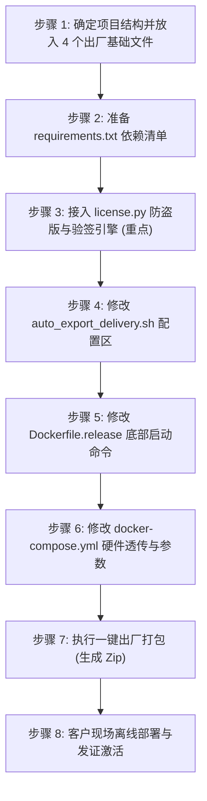

# 🚀 企业级 Python 源码二进制加密与纯离线交付标准操作手册 (v3.0 旗舰版)

> 本套通用交付系统沉淀自 **Archery (Django+MySQL)**、**FastAPI-Admin (Tortoise-ORM+MySQL)** 与 **Full-Stack FastAPI (PostgreSQL+SQLModel+Pydantic v2)** 等多个大型企业级工程的实操打磨。
> **所有模板文件内部均已打上明确的高亮注释标记**：
> * `🔒 【严禁修改】`：核心编译与安全防护引擎（保持默认，勿动）；
> * `👉 【必须修改】`：需要根据当前项目名称、路径、密钥替换的参数；
> * `👉 【按需修改】`：根据数据库类型（PostgreSQL / MySQL / Redis）切换的开关；
> * `🔑 【安全防盗】`：基于 **Ed25519 高性能椭圆曲线** 的宿主机硬件指纹绑定、离线授权与**功能模块分级售卖控制**。

---

## 📂 模板文件与架构总览

```text
Enterprise_Delivery_Universal_Templates/
├── 📄 auto_export_delivery.sh       ➔ [出厂打包器] 一键编译机器码、导出离线镜像并生成 Zip
├── 📄 Dockerfile.release            ➔ [多阶段构建] 负责 Builder 编译/擦除源码 与 Runtime 纯密文运行
├── 📄 docker-compose.yml            ➔ [服务编排] 定义业务与数据库(PG/MySQL)，内置健康检查与硬件透传
├── 📄 build_encrypted.py            ➔ [Cython 加密引擎] 负责将核心代码编译为 .so 并销毁明文
├── 📄 requirements.txt.template     ➔ [依赖标准清单] 包含编译工具链、数据库驱动与 Ed25519 库
├── 📄 license_verifier.py.template  ➔ 🔑 [验签引擎模板] 拷贝到项目中重命名为 license.py 并编译为 .so
├── 📄 probe_machine.sh              ➔ 🔑 [客户机探针] 客户运行提取主板/CPU 32 位机器码 (全平台对齐)
├── 📄 license_issuer.py             ➔ 🔑 [开发者发证台] 留在开发者电脑本地，签发不可篡改的 license.lic
└── 📖 交付模板使用与修改指南.md    ➔ [当前开发与交付标准操作手册]
```

---

## 📋 极简交付 8 步标准操作流程（SOP）



---

### 第一步：判断项目结构并放置出厂文件

首先查看当前项目的目录结构：

* **情况 A（扁平结构 / 单仓）**：项目根目录下直接就是 `main.py` 或 `manage.py` ➔ **直接拷贝到项目根目录**；
* **情况 B（前后端分仓 Monorepo）**：项目根目录下有 `backend/` 和 `frontend/` ➔ **必须拷贝到 `backend/` 目录下**！

将以下 **4 个基础出厂模板文件** 拷贝到该目录下：
* `auto_export_delivery.sh`
* `Dockerfile.release`
* `docker-compose.yml`
* `build_encrypted.py`

---

### 第二步：准备 `requirements.txt`（项目依赖清单）

在项目（或 `backend/`）目录下创建 `requirements.txt`：

```text
# 🔒 【严禁修改/删除】：编译与构建期工具 (Cython 二进制加密必须)
setuptools>=65.0.0
wheel>=0.38.0
cython>=3.0.0

# 🔑 【安全与授权引擎】
cryptography>=41.0.0

# 👉 【必须替换】：将下方替换为当前项目实际需要的业务依赖库
```

---

### 第三步：接入 `license.py` 硬件防盗版与验签引擎（核心防拷步骤）

> 💡 如果您需要防止客户把 Docker 镜像私自拷贝到其他服务器上运行，并按购买模块收费，**必须执行此步骤**！

#### 1. 拷贝模板并重命名为 `license.py`
从模板库中将 **`license_verifier.py.template`** 拷贝到您的项目代码中，并**重命名为 `license.py`**：
* **分层项目（推荐）**：放在 `app/core/license.py`
* **扁平项目**：直接放在根目录下 `license.py`

#### 2. 替换为您的开发者专属 Ed25519 公钥
打开重命名后的 `license.py`，找到第 26 行左右的 `ED25519_PUBLIC_KEY_PEM`：
```python
# 👉 【必须修改】：把引号内的内容替换为您本地 license_issuer.py 生成的公钥文本：
ED25519_PUBLIC_KEY_PEM = b"""-----BEGIN PUBLIC KEY-----
MCowBQYDK2VwAyEAbRtQWdxRcSVM6LdDiClf0BQA1sZ+A3sGRbAA1Mkh/O4=
-----END PUBLIC KEY-----"""
```

#### 3. 在项目入口文件 `main.py` 的首行加入启动验签
打开项目主启动文件（如 `app/main.py` 或根目录 `main.py`），在**代码最顶端第一行**加入验签拦截：
```python
# 🚀 启动首行执行验签：0.05ms 微秒级完成，证书不存在或硬件不匹配直接拒绝启动！
from app.core.license import verify_license   # (如果是扁平项目，写 from license import verify_license)
verify_license("/app/license.lic")

# 下面继续写您原有的代码：
from fastapi import FastAPI
app = FastAPI()
```

#### 4. （可选）在收费业务接口上挂载权限守卫
如果想对特定高级功能收费限制，在对应接口上挂载 `@require_module`：
```python
from app.core.license import require_module

@router.post("/export-data", dependencies=[Depends(require_module("DATA_EXPORT"))])
def export_data():
    return {"msg": "导出成功"}
```

---

### 第四步：修改 `auto_export_delivery.sh` 中的参数

打开 `auto_export_delivery.sh`，在顶部的 `⚙️ 【开发者配置区】` 修改以下参数：

| 参数名 | 标记类型 | 说明与修改建议 |
| :--- | :--- | :--- |
| **`PROJECT_TAG`** | `👉 【必须修改】` | 镜像标签名（例如 `"my_app-release:v1.0.0"`，**必须与 `docker-compose.yml` 的 `image:` 完全一致**） |
| **`DELIVERY_DIR`** | `👉 【必须修改】` | 离线交付目录名（例如 `"MyApp_Delivery_Linux"`） |
| **`OUTPUT_ZIP`** | `👉 【必须修改】` | 最终交付压缩包文件名（例如 `"MyApp_Delivery_Linux.zip"`） |
| **`WEB_PORT`** | `👉 【按需修改】` | 对外服务端口（默认 `8000`） |
| **`EXPORT_POSTGRES`** | `👉 【按需修改】` | 是否导出 PostgreSQL 离线镜像（PostgreSQL 项目设为 `true`，否则 `false`） |
| **`EXPORT_MYSQL`** | `👉 【按需修改】` | 是否导出 MySQL 离线镜像（MySQL 项目设为 `true`，否则 `false`） |
| **`EXPORT_REDIS`** | `👉 【按需修改】` | 是否导出 Redis 离线镜像（若使用了 Redis 设为 `true`，否则 `false`） |

---

### 第五步：修改 `Dockerfile.release` 中的启动命令

打开 `Dockerfile.release`，滚动到**最底部最后一行 `CMD`**：

```dockerfile
# 👉 【必须修改】：根据项目框架类型 3 选 1（取消对应行的注释）：

# 【选项 A：FastAPI 项目 (推荐 - 子目录结构，如 app/main.py)】
CMD ["bash", "-c", "bash scripts/prestart.sh 2>/dev/null || true; python -m uvicorn app.main:app --host 0.0.0.0 --port 8000"]

# 【选项 B：FastAPI 项目 (扁平单文件结构，如根目录下的 main.py)】
# CMD ["python", "-m", "uvicorn", "main:app", "--host", "0.0.0.0", "--port", "8000"]

# 【选项 C：Django 项目 (使用 Gunicorn 启动多进程)】
# CMD ["gunicorn", "wsgi:application", "-b", "0.0.0.0:8000", "-w", "4"]
```

---

### 第六步：修改 `docker-compose.yml` 中的参数与硬件透传

打开 `docker-compose.yml`，修改以下 4 处：

1. **`image:`** ➔ `👉 【必须修改】`：与 `auto_export_delivery.sh` 中的 `PROJECT_TAG` 保持完全相同；
2. **`volumes:` (硬件透传与证书挂载)** ➔ `👉 【必须确认】`：确保以下两行挂载有效（模板默认已内置）：
   ```yaml
       volumes:
         - /sys/class/dmi/id/product_uuid:/etc/host_product_uuid:ro  # 宿主机主板UUID透传
         - ./license.lic:/app/license.lic:ro                        # 客户授权证书
   ```
3. **`DATABASE_URL:`** ➔ `👉 【必须修改】`：配置正确的数据库连接串（PostgreSQL 或 MySQL）；
4. **`SECRET_KEY` & 初始管理员密码** ➔ `👉 【必须修改】`：配置生产安全密钥与初始管理员密码。

---

### 第七步：执行一键出厂打包

在当前终端中执行：

```bash
bash auto_export_delivery.sh
```

**打包器全自动完成以下工作**：
* `[1/4]` 调用 Cython 将核心代码（包括 `license.py`）编译为 `.so` 原生机器码，并彻底销毁 `.py` 明文源码；
* `[2/4]` 剥离 `.so` 符号表信息 (`strip`)，并将业务镜像与数据库镜像导出为独立离线压缩包；
* `[3/4]` 自动生成现场一键秒级安装脚本 `scripts/deploy_linux.sh` 与专业说明手册；
* `[4/4]` 自动打成最终交付 Zip 压缩包 `~/<项目名>_Delivery_Linux.zip`。

---

### 第八步：客户现场 30 秒离线部署与发证激活

1. **采集客户机器码**：
   将 `probe_machine.sh` 发给客户在目标机器上运行：`sudo bash probe_machine.sh`，客户返回 32 位机器码；
2. **开发者签发证书**：
   在您自己电脑运行 `python license_issuer.py`，输入客户机器码与购买天数/模块，生成不可伪造的 `license.lic`；
3. **现场一键拉起**：
   ```bash
   # 1. 解压交付大礼包
   unzip xxx_Delivery_Linux.zip
   cd xxx_Delivery_Linux

   # 2. 将生成的 license.lic 放入当前目录
   cp /path/to/license.lic ./license.lic

   # 3. 运行自动化部署脚本 (纯离线秒级拉起，无需互联网)
   sudo bash scripts/deploy_linux.sh
   ```

---

## 🛠️ 经典踩坑与快速自查表

| 报错信息 | 原因排查 | 解决方案 |
| :--- | :--- | :--- |
| **`ImportError: cannot import name is_module_enabled`** | `license.py` 还是老版本，或者重命名时漏掉了函数 | 重新从最新的 `license_verifier.py.template` 复制并保留公钥 |
| **`401 Unauthorized`** | 访问后台具体受保护页面（如 `/admin/category/list`）但尚未登录管理员账号 | 直接访问专用登录地址 `/admin/login`，输入账号密码登录即可 |
| **`403 Forbidden: 未开通【XXX】功能`** | 客户调用了当前购买套餐中未授权的接口 | 使用 `license_issuer.py` 重新为该客户勾选开通该模块并换发证书 |
| **`[❌ LICENSE ERROR] 授权机器指纹不匹配`** | 容器被拷贝到了未授权的服务器，或探针提取时未加 `sudo` | 提醒客户使用 `sudo bash probe_machine.sh` 提取指纹，并用该机器码发证 |
| **`Invalid control character`** | 证书内容在终端复制粘贴时末尾字符被剪贴板截断 | 确保 `license.lic` 包含完整的签名长串与闭合的花括号 `}` |
| **`... is not a valid module name`** | Alembic/Django 迁移文件名以数字开头，C 函数名不合法 | `alembic` 和 `migrations` 必须在 `build_encrypted.py` 的 `EXCLUDE_DIRS` 中（模板已默认排除） |
| **`could not create 'tests/...so': No such file`** | 编译扫描到了单元测试目录 | `tests` 必须在 `EXCLUDE_DIRS` 中（模板已默认排除） |
| **`Computed field is missing return type annotation`** | Pydantic `config.py` 被 Cython 编译后丢失元反射 | `config.py` 必须在 `EXCLUDE_FILES` 中（模板已默认排除） |
